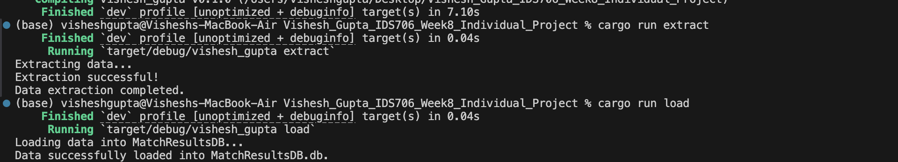
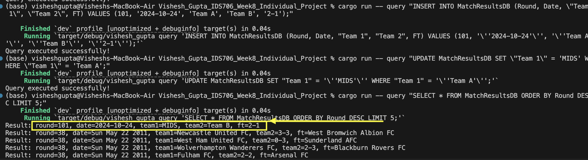
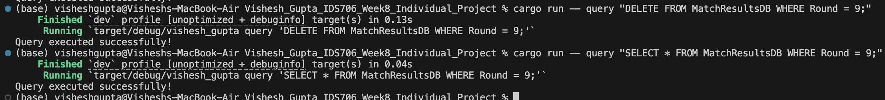

# Vishesh_Gupta_IDS706_Week8_INDIVIDUAL_PROJECT

[](https://github.com/nogibjj/Vishesh_Gupta_IDS706_Week8_Individual_Project/actions/workflows/cicd.yml)

## Project Overview

This project demonstrates a Rust-based command-line interface (CLI) application integrated with an SQLite database. It supports basic CRUD (Create, Read, Update, Delete) operations on the database. Additionally, this project showcases an optimized Rust binary generated through GitLab CI, with automated testing, building, and linting processes. Throughout the development, a Large Language Model (LLM) was utilized to enhance coding efficiency and support Rust's syntax understanding.

```
Vishesh_Gupta_IDS706_Week8_Individual_Project/
├── .devcontainer/
│   ├── devcontainer.json
│   └── Dockerfile
├── .github/
│   └── workflows/cicd.yml
├── .gitignore
├── data/
│   └── match_results.csv
├── Makefile
├── src/
│   ├── lib.rs
│   ├── main.rs
├── Cargo.toml
├── README.md
├── query_log.md
└── MatchResultsDB.db
```

## 2. **CRUD Operations**
We demonstrate the following CRUD operations:
- **Create:** Insert new records into a table.
- **Read:** Query and retrieve records from the table.
- **Update:** Modify existing records within the table.
- **Delete:** Remove records from the table.

### Set up and Running Rust

#### First, compile the Rust project by running:
```bash
cargo build
```

#### Now we can Run the project by:
- Extract Data: To run the data extraction process, execute:
```bash
cargo run extract
```
- Load Data: To load the extracted data into the SQLite database, run:
```bash
cargo run load
```
Query Data: To query the data, use the following command. Replace [query] with your SQL query:
```bash
cargo run query "[query]"
```
These commands will allow you to extract, load, and query data within the SQLite database using the CLI.

#### We can see how it operates in the screenshots below







## Utilizing an LLM for Learning and Code Conversion

In the development of this Rust-based CLI application, I leveraged a Large Language Model (LLM) to aid in understanding Rust’s syntax and structure. As someone new to Rust, I sought to gain familiarity by taking an existing demo project and working through it line-by-line. The LLM provided crucial guidance during this initial phase, helping me to:

- **Adapt Familiar Logic into Rust**: With each line, the LLM provided explanations on how concepts familiar in other languages—such as loops, conditional checks, and data structures—are implemented in Rust. It also suggested alternative idiomatic approaches, ensuring the code followed Rust's best practices.

- **Gain Confidence for New Code**: By understanding the syntactical differences and idiomatic Rust through these guided conversions, I was able to move from simple translations to writing new functionality independently. For instance, I extended the CRUD operations to handle multiple data types and provided additional error handling, a skill I honed through LLM-assisted learning.

By incorporating the LLM in this project, I was able to quickly overcome the Rust learning curve, allowing me to focus more on building features rather than purely syntax troubleshooting. This experience underscores the LLM’s utility as a coding companion, supporting both syntax learning and code creation.

## Youtube Video
[click here](https://youtu.be/44Nw-jnQYmM)
